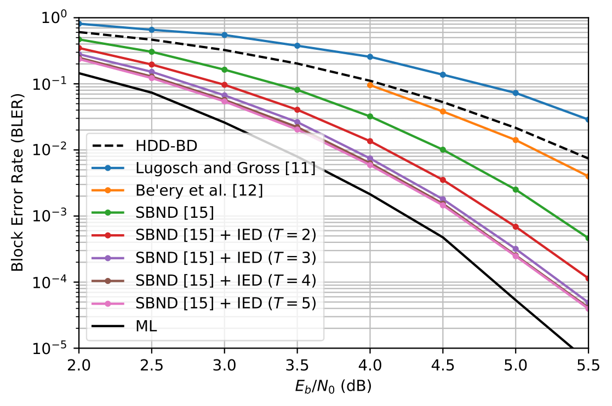
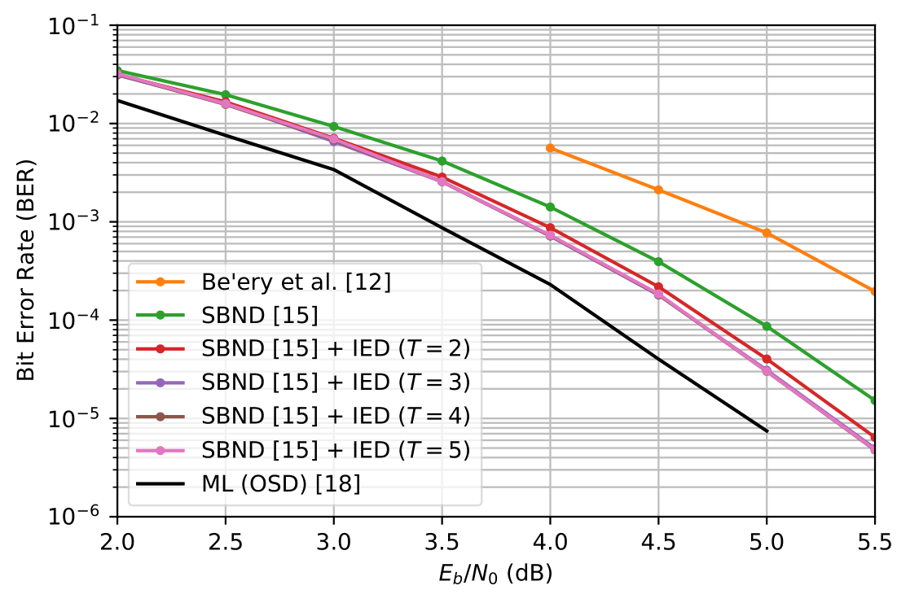
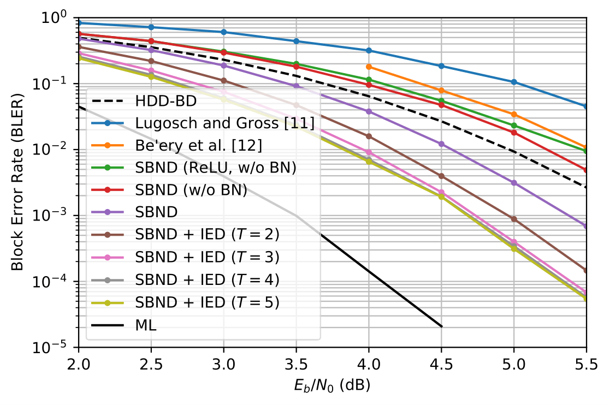
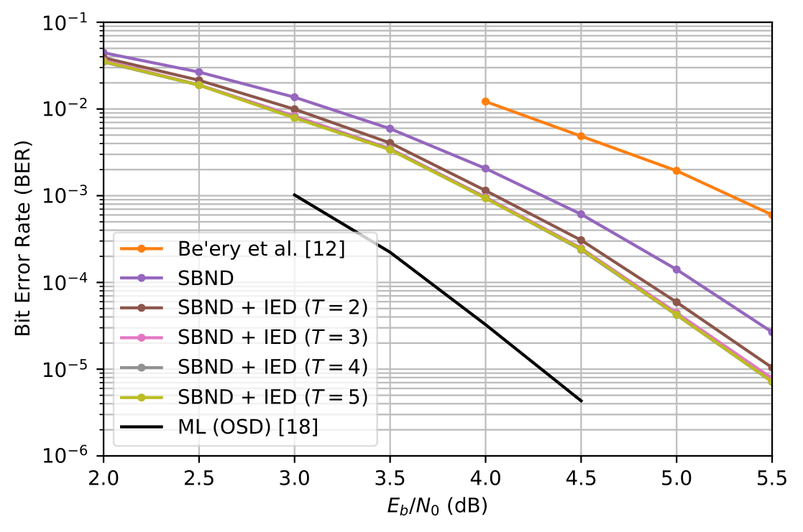

## Iterative Error Decimation

[](https://arxiv.org/abs/2012.00089)
[](https://github.com/Kamassury/IED/blob/main/LICENSE)

This repository contains the codes for [*Iterative Error Decimation for Syndrome-Based Neural Network Decoders*](https://arxiv.org/abs/2012.00089) , accepted for publication in Journal of Communication and Information Systems (JCIS).

If the code or the paper has been useful in your research, please add a citation to our work:

```
@article{kamassury2021ied,
  title={Iterative Error Decimation for Syndrome-Based Neural Network Decoders},
  author={Kamassury, Jorge K S and Silva, Danilo},
  journal={Journal of Communication and Information Systems},
  year={2021}
}
```

## Files 
``main_code``:

## Project overview
For an overview of the project, follow the steps from the [main_code.py](main_code.py) code, namely:
* Get the parity check matrix (H):   ``bch_par``  
* Building the neural network: ``models_nets``
* Model training: `training_nn`
* Model inference using the IED decoder: ``BER_FER``
* Plot of inference results: ``inference``

The default configuration (using the function [get_training_model.py](get_training_model.py)), will train a model with the cross entropy as the loss function. The following are the important parameters of the training 

* ``training_nn(model, H, loss, lr, batch_size=2048, spe, epochs0, EbN0_dB, tec) ``, where:
	* ``model``: neural network for short length BCH code
	* ``H``: parity check matrix
	* ``loss``: loss function (by default, binary cross entropy)
	* ``lr``:  learning rate

### Pretrained models

All pre-trained models are in the folder [models](models), where:
* ``model_63_45``: trained model for the BCH(63, 45) code;
* `model_relu_63_36`: trained model for BCH(63, 36) code using __ReLU__ as activation function;
* `model_sigmoid_63_36`: trained model for BCH(63, 36) code using __Sigmoid__ as activation function;
*  `model_BN_sigmoid_63_36`: trained model for BH(63, 36) code using __Sigmoid__ as activation function and __batch normalization layers__.


## Result

Performances for BCH codes using the IED decoder are in the folder [results](results).

* BLER and BER for the BCH(63,45) code, respectively:
<p align="center">
	
	
</p>


* BLER and BER for the BCH(63, 36) code, respectively:
<p align="center">
	
	
</p>
